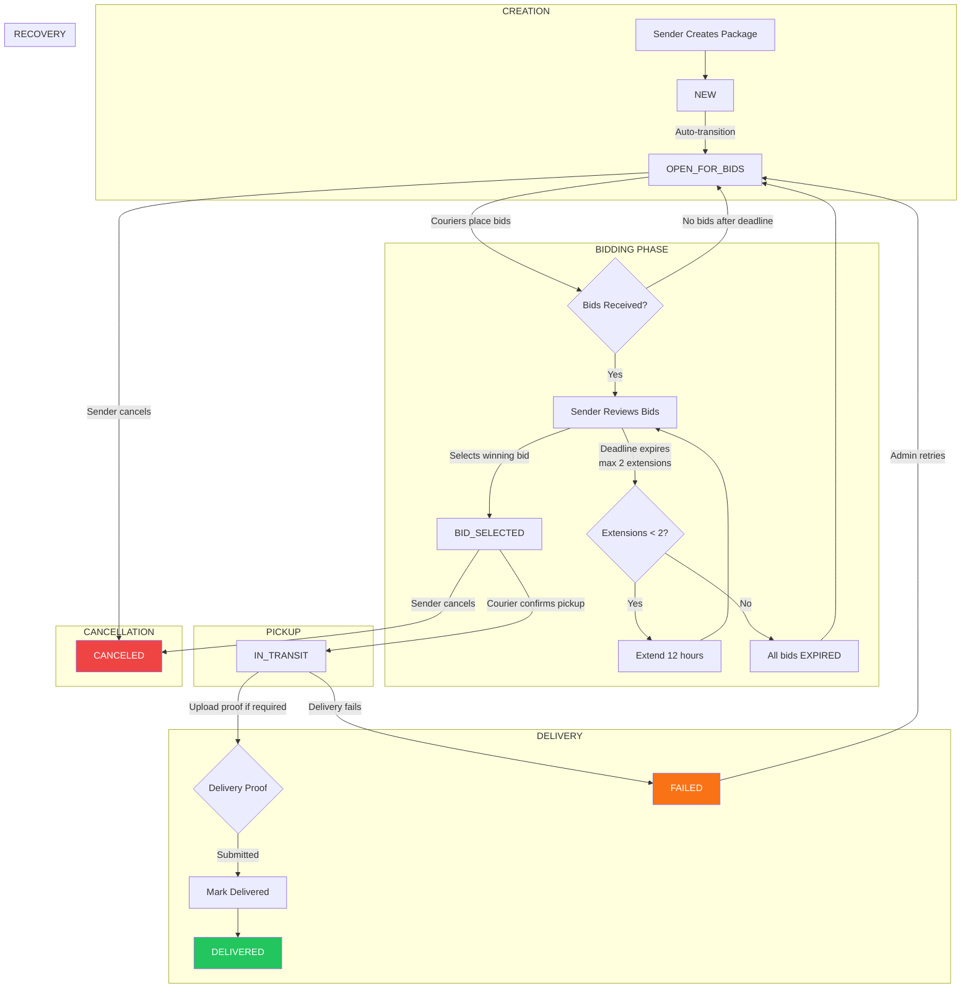
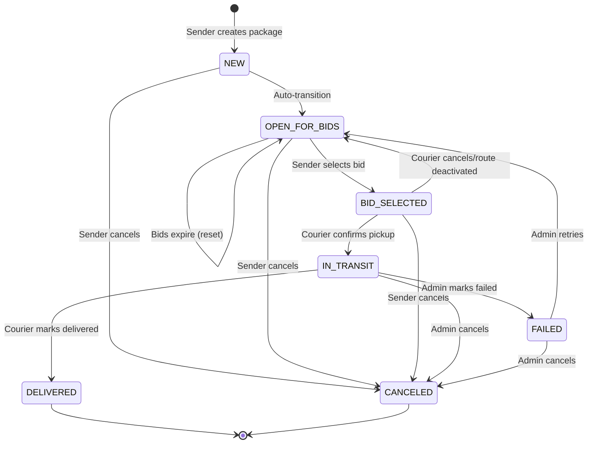
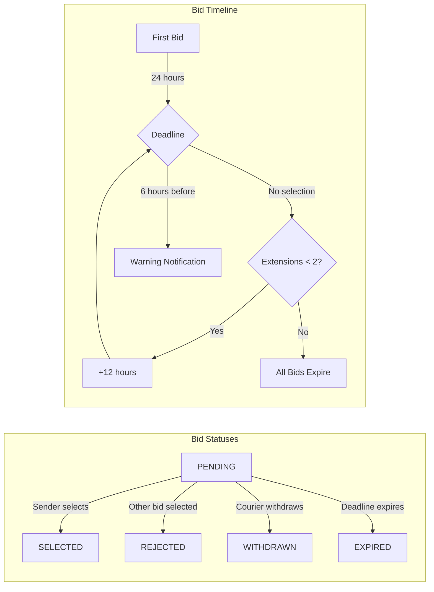
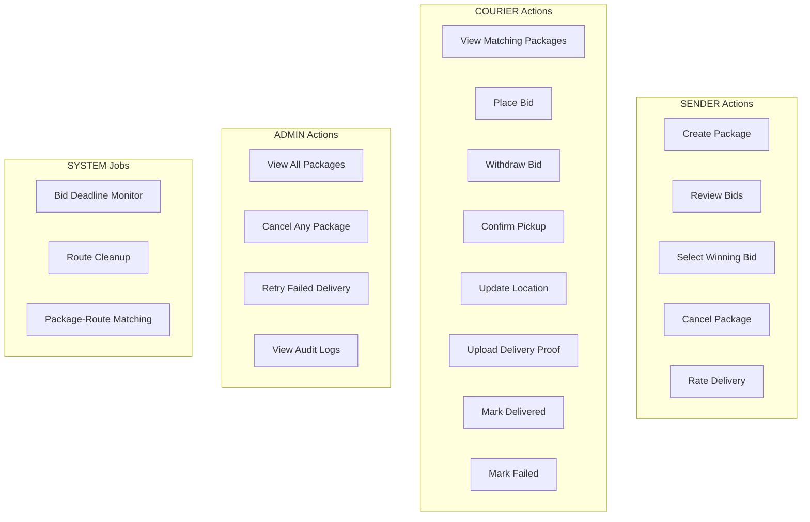

# Package Lifecycle Flowchart - Chaski Logistics Platform

## Overview

This document provides a complete visualization of the package lifecycle in the Chaski platform, including all states, transitions, actors, and notifications.

---

## Package Status States

| Status | Description | Terminal? |
|--------|-------------|-----------|
| `NEW` | Just created, auto-transitions immediately | No |
| `OPEN_FOR_BIDS` | Accepting courier bids | No |
| `BID_SELECTED` | Sender selected a winning bid | No |
| `PENDING_PICKUP` | *Currently unused - transitions directly to IN_TRANSIT* | No |
| `IN_TRANSIT` | Courier picked up, delivering | No |
| `DELIVERED` | Successfully delivered | **Yes** |
| `CANCELED` | Sender/admin canceled | **Yes** |
| `FAILED` | Delivery attempt failed | No (admin can retry) |

---

## Main Flowchart (Mermaid)



---

## Detailed State Transition Diagram



---

## Bidding Lifecycle Detail



---

## Actor Responsibilities



---

## Notifications by Stage

| Stage | Recipient | Notification Type | Message |
|-------|-----------|-------------------|---------|
| **Bid Placed** | Sender | `NEW_BID_RECEIVED` | "New bid of $X from Courier" |
| **Bid Placed** | Courier | `BID_PLACED` | "Your bid was placed" |
| **Bid Withdrawn** | Sender | `BID_WITHDRAWN` | "Courier withdrew bid" |
| **6hr Warning** | Sender | `BID_DEADLINE_WARNING` | "Select a bid within 6 hours" |
| **Extended** | Sender | `BID_DEADLINE_EXTENDED` | "Deadline extended 12 hours" |
| **Expired** | All | `BID_DEADLINE_EXPIRED` | "Bidding period ended" |
| **Bid Selected** | Winner | `BID_SELECTED` | "Your bid was selected!" |
| **Bid Selected** | Others | `BID_REJECTED` | "Another courier selected" |
| **Pickup** | Sender | `PACKAGE_ACCEPTED` | "Package picked up, in transit" |
| **Delivered** | Sender | `PACKAGE_DELIVERED` | "Package delivered!" |
| **Canceled** | Courier | `PACKAGE_CANCELLED` | "Package was cancelled" |
| **Failed** | Sender | `DELIVERY_FAILED` | "Delivery failed, contact support" |

---

## Valid State Transitions Matrix

| From State | To States |
|------------|-----------|
| `NEW` | `OPEN_FOR_BIDS`, `CANCELED` |
| `OPEN_FOR_BIDS` | `BID_SELECTED`, `CANCELED` |
| `BID_SELECTED` | `PENDING_PICKUP`, `OPEN_FOR_BIDS`, `CANCELED` |
| `PENDING_PICKUP` | `IN_TRANSIT`, `CANCELED` |
| `IN_TRANSIT` | `DELIVERED`, `FAILED` *(admin only)*, `CANCELED` *(admin only)* |
| `DELIVERED` | *(terminal - none)* |
| `CANCELED` | *(terminal - none)* |
| `FAILED` | `OPEN_FOR_BIDS` *(admin only)*, `CANCELED` *(admin only)* |

---

## Timestamps Tracked

| Field | Set When |
|-------|----------|
| `created_at` | Package created |
| `updated_at` | Any field updated |
| `status_changed_at` | Status changes |
| `bid_deadline` | First bid placed (+24h) |
| `bid_selected_at` | Bid selected |
| `pending_pickup_at` | PENDING_PICKUP status |
| `in_transit_at` | IN_TRANSIT status |
| `delivery_time` | DELIVERED status |
| `failed_at` | FAILED status |

---

## Happy Path Summary

```
1. Sender creates package
   |
   v
2. Package OPEN_FOR_BIDS (couriers bid for 24-48h)
   |
   v
3. Sender selects winning bid --> BID_SELECTED
   |
   v
4. Courier confirms pickup --> IN_TRANSIT
   |
   v
5. Courier uploads delivery proof (if required)
   |
   v
6. Courier marks delivered --> DELIVERED
   |
   v
7. Payment released, ratings enabled
```

---

## Edge Cases

1. **No bids received**: Package stays in OPEN_FOR_BIDS indefinitely
2. **Sender doesn't select bid**: Auto-extends twice, then all bids expire and reset
3. **Courier cancels after selection**: Package returns to OPEN_FOR_BIDS
4. **Route expires**: Courier's bids auto-withdrawn
5. **Delivery fails**: Admin can retry, resets to OPEN_FOR_BIDS
6. **Package requires proof**: Cannot mark delivered without uploading proof

---

## Key Source Files

| File | Purpose |
|------|---------|
| `app/models/package.py` | Package model, PackageStatus enum |
| `app/services/package_status.py` | State transition validation |
| `app/routes/packages.py` | Package CRUD, status updates |
| `app/routes/bids.py` | Bidding system |
| `app/services/bid_deadline_job.py` | Deadline management |
| `app/services/route_deactivation_service.py` | Route cleanup |
| `app/routes/delivery_proof.py` | Proof upload |
